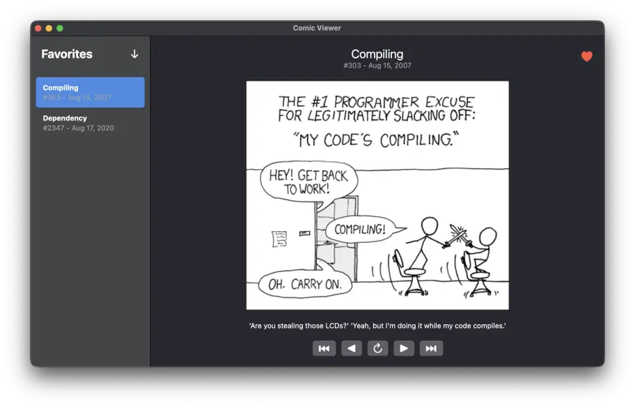

# Comic Viewer

This repository contains a cross-platform port of our [Comic Viewer](https://github.com/pwsacademy/comicviewer) sample application, built using [SwiftCrossUI](https://swiftcrossui.dev) (SCUI). It resembles the original SwiftUI implementation as much as possible.

This project is very experimental and mostly serves to track the current state of SwiftCrossUI. Issues related to this port are collected [here](https://github.com/moreSwift/swift-cross-ui/issues/353).

> This app is made for educational purposes only.
> All content is provided by [XKCD](https://xkcd.com) under the [CC BY-NC 2.5](https://creativecommons.org/licenses/by-nc/2.5/) license.
